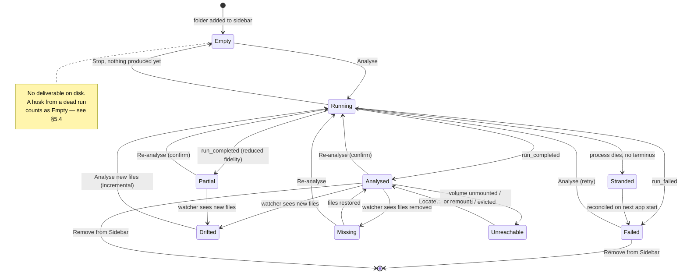
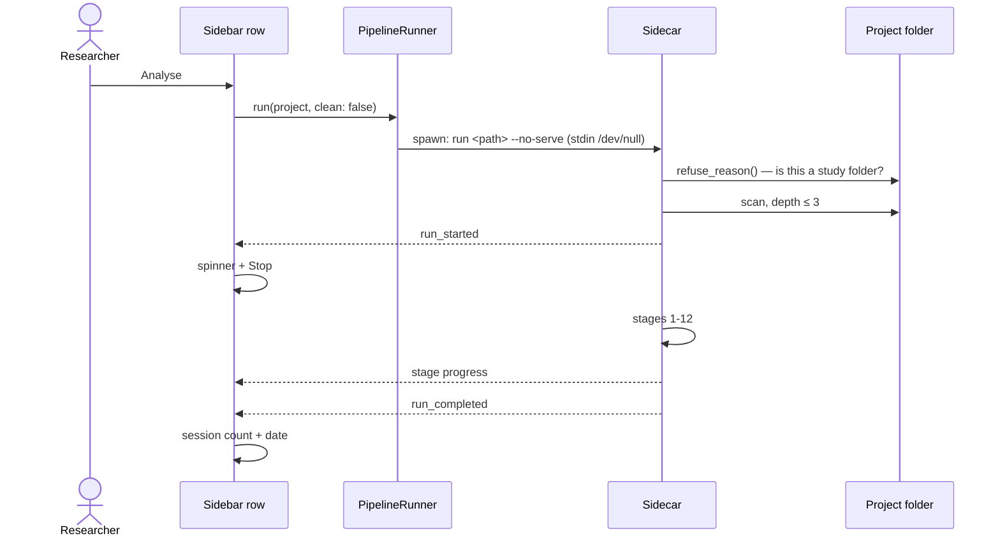
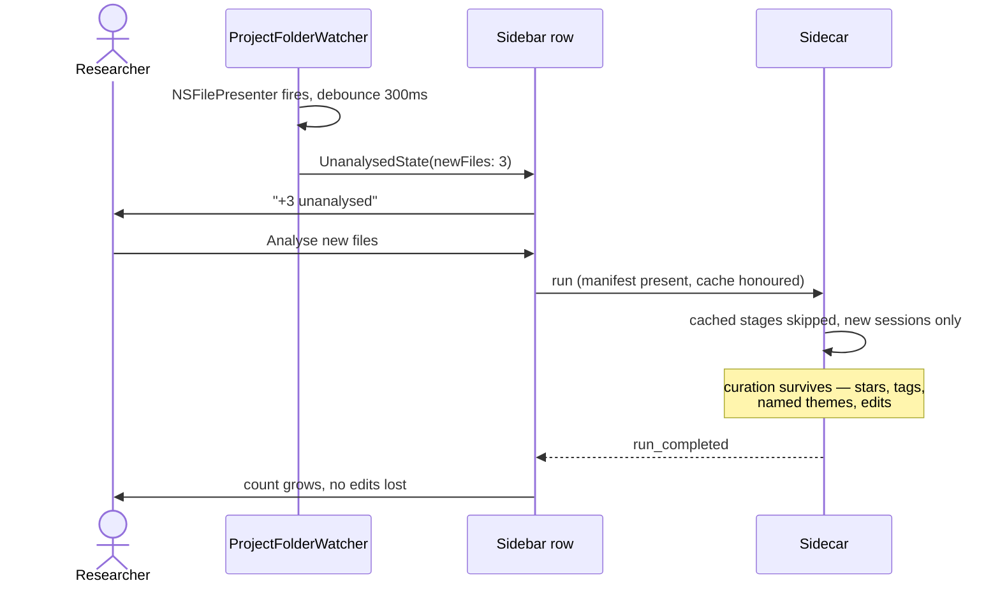
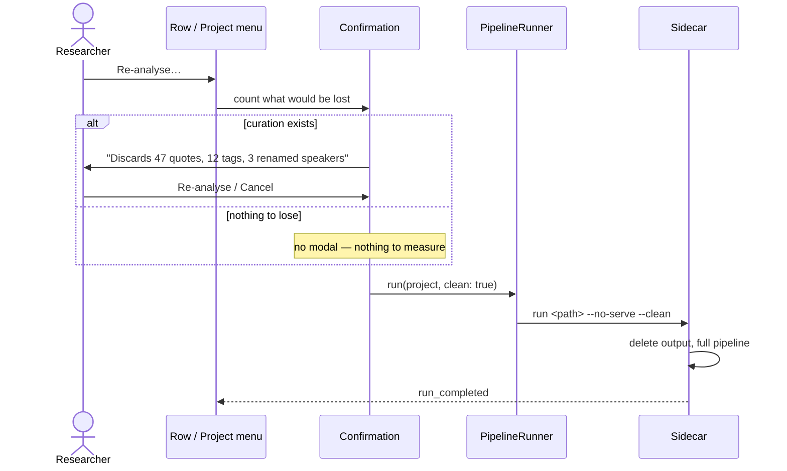

# The analysis lifecycle — analyse, re-analyse, incremental

**What this doc is.** The cross-cutting view: one state machine and one set of
sequences covering all three verbs, the affordances that trigger them, and the
failure modes each can land in. It exists because the per-surface docs each own
a slice and none of them owns the whole:

| Doc | Owns |
|---|---|
| [design-incremental-analysis.md](design-incremental-analysis.md) | *Why* incremental — the physical-stickies model, what's immutable vs fluid, identity reconciliation |
| [design-incremental-analysis-plan.md](design-incremental-analysis-plan.md) | *How* — the level-2 build plan and its scope boundary |
| [design-desktop-project-status.md](design-desktop-project-status.md) | The row's status grammar and the exception-precedence chain |
| [design-sidebar-activity-indicators.md](design-sidebar-activity-indicators.md) | In-flight visual vocabulary (spinner, ring, Stop) |
| [design-pipeline-diagnostic-popover.md](design-pipeline-diagnostic-popover.md) | The failure taxonomy, `MessageKind`, the two-mirror trap |
| [design-pipeline-resilience.md](design-pipeline-resilience.md) | Manifest, event sourcing, resume, provenance |

**What this doc is not.** It does not redefine the row grammar, the message
taxonomy, or the incremental rules. Where it needs one, it cites it. If this
doc and one of those disagree, **the owning doc wins** and this one is stale.

---

## 1. Three verbs, and why they must stay three

| Verb | Question it answers | Destructive? | Status |
|---|---|---|---|
| **Analyse** | "There's nothing here yet — do the study." | No | Shipped |
| **Incremental** | "Three new interviews arrived — fold them in." | No | Shipped 0.20.0 (level 2) |
| **Re-analyse** | "Throw the analysis away and start over." | **Yes** | **Not implemented** — see §6 |

The failure mode to design against is *collapsing them*. If "re-analyse" and
"analyse the new files" become one control, the safe verb disappears and the
researcher's edits become collateral. They share a pipeline; they are not the
same offer.

### 1.1 Two project shapes, and why it changes every answer

`wasFolderShaped = (project.inputFiles == nil)` (`ContentView.swift:1705`) splits
the lifecycle in two, and nothing below makes sense without it.

| | **Folder-shaped** | **File-subset** |
|---|---|---|
| Origin | a folder was dropped / chosen | individual files were dropped |
| Project *is* | the folder | a list of paths inside a folder |
| New files fold in? | **Yes** — the CLI rescans the folder at run time, so the per-session cache re-transcribes only what's new | **No** — the CLI can't scope a `--files` run |
| Drop onto it when analysed | copied, folds in on next Analyse | copied, then a toast: "Adding extra interviews to an analysed project isn't supported yet" |
| Route to include new work | **Analyse** (already incremental) | **Re-analyse** (full, destructive) |

**Consequence: for a folder-shaped project, `Analyse` *is* the incremental verb.**
There is no separate command to build, and proposing one would duplicate a
shipped behaviour. What's missing is that the researcher cannot tell, from the
control, that running it is safe.

**What it actually does, measured** (19 Aug 2026, folder-shaped, nothing new):
every LLM stage reports `(cached)`, stages 1–2 and 6 re-run because they're
cheap, stage 12 re-renders, **total 0.1s and no spend**. With new files present
the same command becomes incremental — the new sessions miss the per-session
cache and are processed, the rest load from disk.

**Why curation survives, and when it would stop.** `importer.py` promises that
"researcher state (starred, hidden, tags, edits, deleted badges) is preserved
for quotes that survive the re-import", matched on a stable key — and its own
line 216 records the caveat: the promise "only holds when the existing row is
matched". So the safety comes from **not redoing the work**, not from
reconciling it. Cached stages don't regenerate quotes, so keys don't move and
state reattaches. If a stage cache were ever invalidated, quotes could return
under different keys and their curation would be orphaned — silently, because
the import would still report success. Any change that can invalidate a stage
cache must be read against that sentence.

**For a file-subset project the honest offer is Re-analyse**, and the toast's
"isn't supported yet" is misleading — including the files is entirely possible,
it just costs a full re-run. Saying so would let the researcher choose.

---

## 2. The state machine

States are the project row's, as the researcher sees it. The Swift types behind
them are `ProjectAvailability` (`ready` / `cantFind` / `inCloud`) and
`SubtitleVariant` (`ready` / `failed` / `failedDiagnostic` / `completedPartial`
/ `stopping` / `deltaOnly` / `placeholder`).

**Why `Stranded` is a state and not an accident.** A run whose process dies
without writing a terminus event is indistinguishable, on disk, from one still
in flight. The reconciliation on next start is what converts it to `Failed`.
Without that state named, the row shows a spinner forever — which is what an
eleven-hour hang looked like on 19 Aug 2026.

**Why `Drifted` and `Missing` are separate.** `UnanalysedState` carries
`newFiles` and `missingFiles` independently, and they want different verbs:
new files invite incremental, missing files invite *nothing* — they are a
statement, not a prompt. Conflating them produces a call to action for a
situation with no action.

---

## 3. Sequences

### 3.1 Analyse — the happy path

### 3.2 Incremental — new files fold in

### 3.3 Re-analyse — the destructive one

---

## 4. Affordance inventory

Where each verb can be reached, and what gates it.

| Affordance | Surface | Enabled when | State today |
|---|---|---|---|
| **Analyse** | sidebar context menu, Project menu | folder-shaped, has path, not running — **does not check for media** | Shipped, over-offered (§4.1) |
| **Analyse** (auto) | after a cloud-import batch lands | folder-shaped project | Shipped (`1490dcde`) |
| **File ▸ Add Files…** | File menu | a project is selected | Shipped |
| **+N unanalysed** pill → sheet | row subtitle | `newFiles` non-empty | Shipped |
| **Analyse** (folder-shaped) | context menu | `newFiles` non-empty | Shipped — **already incremental**, but unlabelled as such |
| Primary action on the unanalysed sheet | sheet | `newFiles` non-empty | **Absent — only Close. See §6.2** |
| **Stop Analysis** ⌘. | Project menu, row hover-× | running | Shipped |
| **Re-analyse…** | Project menu | — | **`.disabled(true)`, unimplemented** |
| **Re-analyse…** | sidebar context menu | — | **Absent** |
| **Locate…** | context menu, Project menu | `cantFind` | Shipped |
| **Show Diagnostics…** | failure glyph, context menu | `failed` / `completedPartial` | Shipped |

### 4.1 Enablement matrix — the logic that is missing

The two verbs fail in opposite directions today. **Re-analyse…** is
`.disabled(true)` and can never light up. **Analyse** is offered whenever the
project is folder-shaped, has a path, and isn't running — `canAnalyse`
(`ProjectSidebarOutline.swift:1707`) **never asks whether there is anything to
analyse**, so it appears on a project with no recordings at all, beside an empty
state that says "Add interview recordings or transcripts to get started".

Both need the same missing input: *does this project have work to do?*
`UnanalysedState` already carries it — `newFiles` (eligible, not yet ingested)
and `sessionCount` (rows in `sessions`).

| Project state | `newFiles` | `sessionCount` | **Analyse** | **Re-analyse…** | **Stop** |
|---|---|---|---|---|---|
| Empty — no media at all | 0 | nil / 0 | **hide** ← *shown today* | hide | hide |
| Has media, never analysed | >0 | nil / 0 | **Analyse** | hide | hide |
| Analysed, nothing new | 0 | >0 | **hide** — measured: 0.1s, all cached, no visible change | **Re-analyse…** ← *dimmed today* | hide |
| Analysed, new files present | >0 | >0 | **Analyse *N* New Files** | Re-analyse… | hide |
| Running | — | — | hide | hide | **Stop Analysis** ⌘. |
| Failed / partial | any | any | Analyse (retry) | Re-analyse… | hide |
| File-subset, analysed | >0 | >0 | hide *(correct today)* | **Re-analyse…** — the only route | hide |
| `cantFind` / evicted | — | — | hide | hide | hide |

Read "hide" as hide in a **context** menu and dim in the **menu bar**, per the
rule below. The one exception is *unimplemented*, which hides in both.

Two things fall out of writing it down. **"Analysed, nothing new" is the state
that wants Re-analyse and nothing else** — offering Analyse there is offering a
no-op that hits cache and changes nothing, which teaches the researcher that the
button does nothing rather than that they picked the wrong one. And **the empty
project is the clearest false affordance in the app**: the detail pane already
says there is nothing to analyse, while the context menu's first and highlighted
item says otherwise.

**Dim vs hide.** `MenuCommands.swift` states the rule in its own comment —
*"dimmed (not hidden) when it isn't running, per menu-bar HIG (context menus
hide instead)"*. That is right for **Stop Analysis**: state-dependent, so
dimming honestly means "not right now". It is wrong for **Re-analyse…** and
**Archive…**, which are `.disabled(true)` hardcoded with no state that could
ever enable them. Dimming says "not yet in this situation"; the truth is "not
in this build". A researcher reasonably hunts for the state that lights it up,
and there isn't one. **Unimplemented ⇒ hide.**

---

## 5. Failure modes

Every row below was observed, not imagined. The corpus that produced them is
built by `experiments/folder-of-horrors/synthesise.sh`.

### 5.1 The taxonomy

Four outcomes, not three. The fourth was found on 19 Aug 2026 and is worse than
the one previously considered worst.

| # | Outcome | Acceptable? |
|---|---|---|
| 1 | Ingested and analysed | ✅ |
| 2 | Refused **by name, with a reason** | ✅ — a stated refusal is a pass |
| 3 | Silently dropped | ❌ the classic failure |
| 4 | **Took the whole batch down** | ❌❌ worse at scale |

Outcome 4 matters because it inverts with n: one bad file among a hundred costs
ninety-nine good ones. Outcome 3 costs one participant; outcome 4 costs the study.

### 5.2 Fixed

| Failure | Shape | Fix |
|---|---|---|
| Zero-byte upload aborted a 42-session run | outcome 4 | `MediaFileDamagedError` — file verdict ≠ tool verdict |
| 16 real recordings silently declined | outcome 3 | formats 16 → 27; `discover_files` records what it declines |
| `.Trash` killed the whole scan | outcome 4 | unreadable directory recorded and stepped over |
| Cloud placeholders downloaded to read their length | invisible cost | discovery no longer materialises |
| >16 sessions prompted a headless sidecar | **11-hour hang** | count guard removed; sidecar stdin `/dev/null` |
| Failed run's husk walled off the retry | dead end | guard tests for a *deliverable*, not for existence |

### 5.3 Open

| Failure | Consequence | Where it should be fixed |
|---|---|---|
| **Stale cause outranks the live one** | A refused new attempt shows the *previous* run's cause. Observed: headline read "EOF when reading a line" (an 11-hour-old run) while the real blocker, "Output directory already exists", sat below it in Last output. | Diagnostic popover — the freshest attempt must own the headline |
| **`--clean` advice in a GUI** | The app cannot pass a flag. The advice is unfollowable, and the only way out is deleting a folder — a mental model of our plumbing that no researcher should need | Re-analyse… (§6), so the app does it |
| **Re-analyse… permanently dimmed** | False affordance; teaches that the app is broken | Implement or hide |
| **`EOFError` surfaces raw** | "EOF when reading a line" names the mechanism, not the problem | `failure_classifier` — map it to a bug signature |

### 5.4 Edge cases

| Case | Correct behaviour | Today |
|---|---|---|
| Output dir exists, **no deliverable** | reuse silently — nothing to protect | ✅ fixed 19 Aug |
| Output dir exists **with** a report | refuse, offer Re-analyse… | refuses; offer missing |
| Manifest present, run incomplete | resume | ✅ shipped |
| Run stranded, no terminus | reconcile to `failed` on next start | ✅ shipped |
| Project folder is `/` or `$HOME` | refuse by name, before scanning | ✅ fixed 19 Aug |
| Folder holds a protected subdirectory | step over it, record it | ✅ fixed 19 Aug |
| Media at depth 4+ | not ingested | by design — `_MAX_SCAN_DEPTH = 3` |
| Files removed after analysis | state it, offer nothing | ✅ `missingFiles` |
| Volume unmounted mid-run | `cantFind` + Locate… | ✅ shipped |
| Drop onto an analysed **folder-shaped** project | copy, fold in next Analyse | ✅ shipped |
| Drop onto an analysed **file-subset** project | say it needs a full re-run, and offer it | toast says "isn't supported yet" — misleading, it is possible via Re-analyse |
| Files added in **Finder** | detect, report, **and offer the action** | detects and reports; offers nothing |
| Zero sessions found | say so, don't render an empty report | ✅ "No usable content" |

---

## 6. Gaps

### 6.1 Re-analyse is a placeholder at both ends

`MenuCommands.swift:1003` is `.disabled(true)  // Future — Phase 2+`, and the
action it fires — `bridgeHandler.menuAction("reAnalyse")` — dispatches an event
into the web layer that **nothing listens for**. Flipping the boolean produces a
control that appears to work and silently does nothing.

Implementing it needs four things, not one:

1. **Route natively.** Its sibling uses `windowCommands?.perform(.stopProject)`;
   Re-analyse uses the web bridge. It is a native project action of exactly
   Stop's shape and should take the same route. The bridge round-trip is
   plausibly *why* it stalled — it needs a React listener with no reason to exist.
2. **An enablement predicate** — has an analysis, not running. Then dimming
   becomes honest and the item can stay visible.
3. **A confirmation that measures the loss**, in the researcher's terms
   ("47 edited quotes, 12 tags, 3 renamed speakers"), and silence when there is
   nothing to lose. The `…` already promises this.
4. **The context menu**, where by the codebase's own rule it is present or
   absent, never dimmed.

### 6.2 The Finder-side path dead-ends

There are three ways new interviews reach an existing project. Two are wired:

| Route | Folder-shaped | File-subset |
|---|---|---|
| Drag-drop onto the row | ✅ copies, folds in on next Analyse | ⚠️ copies, then the toast |
| **File ▸ Add Files…** | ✅ same path | ⚠️ same toast |
| **Added in Finder** | **⛔ dead end** | **⛔ dead end** |

The third has no drop event and no menu action to hang off — which is precisely
why `ProjectFolderWatcher` exists. It fires, the row shows `+N unanalysed`, the
pill opens `NewFilesSheet`… whose only button is **Close**. `NewFilesSheet.swift`
concedes this in its own header: *"Retire when EITHER (a) incremental processing
lands…"*.

So the app detects the situation, reports it accurately, and offers nothing.

**This is not a missing verb.** For a folder-shaped project, Analyse already
does the incremental work. It is two smaller things:

1. **The sheet needs a primary action** — the thing it is describing. Today a
   researcher who opens it to act must close it and find the action elsewhere.
2. **The control needs to say what it will do in this state.** "Analyse" gives
   no clue whether edits survive. Labelling it for the state — *Analyse 3 New
   Files* — is the same command, named honestly. That is a label, not a feature.

Sequencing note: fix the dead end before adding a menu item. A sheet that can
act on what it reports may make the extra context-menu entry unnecessary.

---

## 7. Open questions

- **Does the confirmation count, or estimate?** Counting edits exactly needs a
  DB query before the modal. Estimating is cheaper and vaguer. A terse modal
  measures — see the house rule — which argues for counting.
- **Should Re-analyse offer to keep the codebook?** The codebook is curation
  too, but it is also the thing most likely to be *wanted* across a re-run.
  `design-incremental-analysis.md` §"What's immutable" is the place to settle it.
- **What happens to a project mid-re-analysis that fails?** It has no old
  analysis (deleted) and no new one. That is a new `Empty` — correct by this
  machine, and worth confirming it is what the row actually shows.
